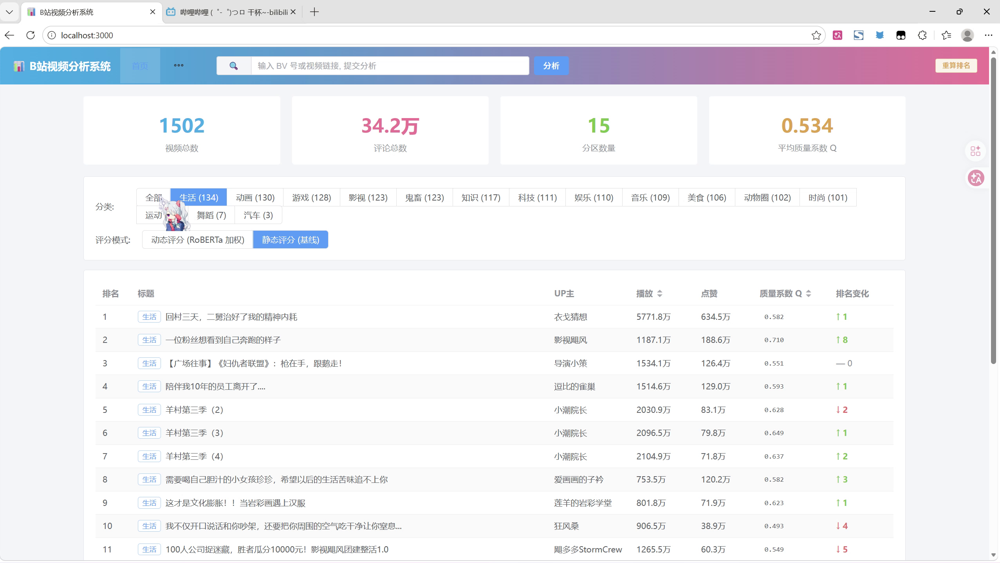
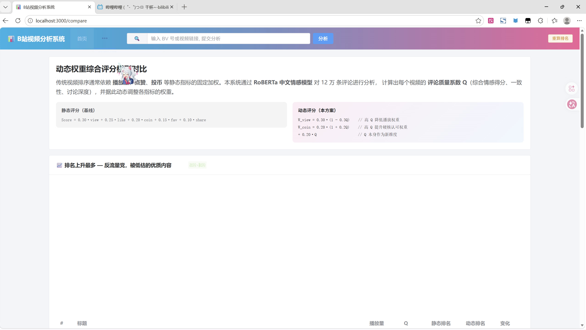
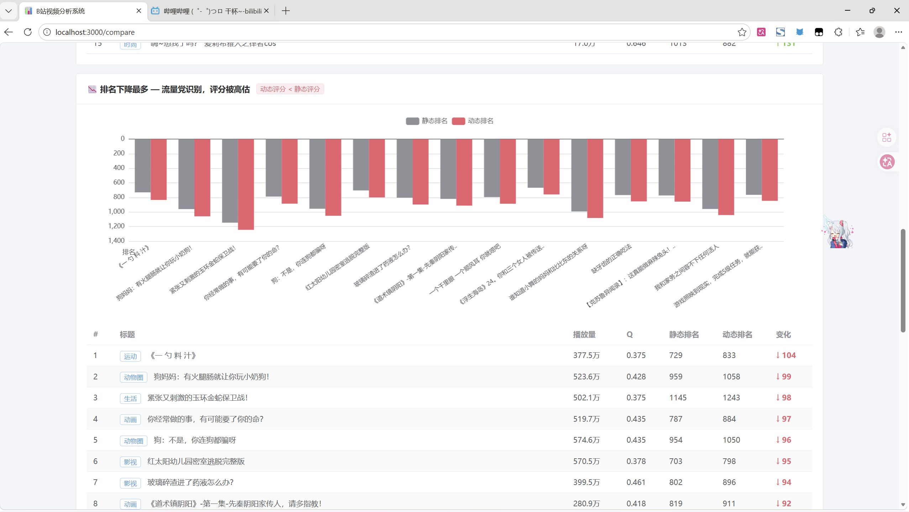
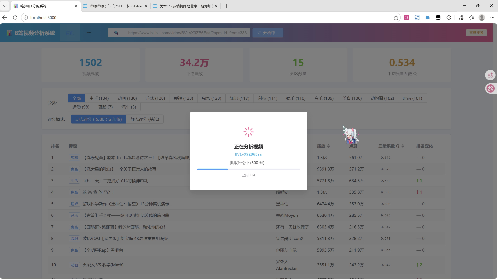
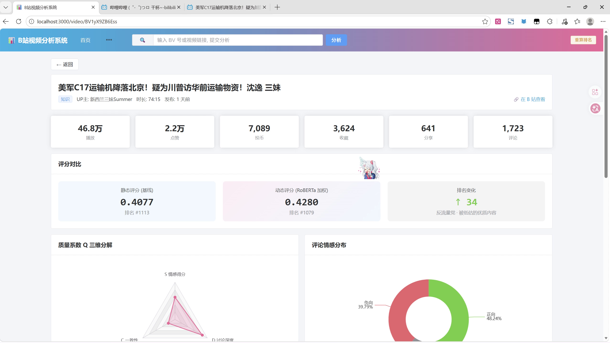
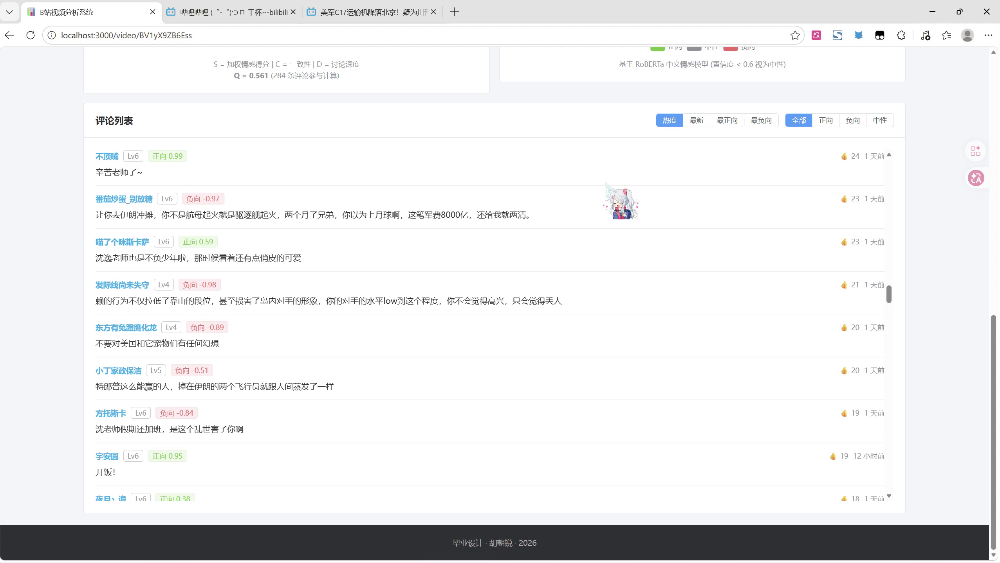

# 基于大数据的哔哩哔哩视频数据分析与综合评分可视化系统

> 本科毕业设计 · 独立完成 · 2026
>
> **English abstract** — An end-to-end video quality evaluation system built on Hadoop + Spark +
> RoBERTa + Flask + Vue 3. It collects 1,497 Bilibili videos (15 categories) and 377,892 raw
> comments, runs Chinese sentiment analysis over the cleaned 342,450 comments, and introduces a
> **Comment Quality Coefficient Q** to dynamically re-weight engagement metrics, exposing
> high-quality but underrated content that static ranking buries.

---

## 一、项目要解决的问题

B 站的视频排序长期依赖**播放量、点赞、投币等静态指标的固定加权**。这套规则有两个明显缺陷：

- **流量大 ≠ 内容好**：标题党、擦边内容靠推荐流量冲上高位；
- **流量小 ≠ 内容差**：深度赏析、音乐歌单、慢内容因缺少曝光被长期埋没。

本项目引入 **评论质量系数 Q**，用中文情感模型从评论区提取内容质量信号，并据此**动态调整各指标的权重**，使排序结果更贴近真实内容质量。

---

## 二、系统截图

### 1. 排行榜首页：动态评分与静态评分可切换



顶部四个指标为系统总览（视频总数 / 评论总数 / 分区数量 / 平均质量系数 Q），
支持按 15 个内容分区筛选，并可在**动态评分（RoBERTa 加权）**与**静态评分（原始）**之间切换，
排行榜直接给出每个视频的 `质量系数 Q` 与 `排名变化`。

### 2. 核心创新：静态加权 vs 动态加权



页面并排展示两套评分公式，便于直观对比权重调整带来的排名变化。

### 3. 排名变化对比分析



配合全样本散点图（Q 值 × 排名变化）与分区平均 Q 柱状图，验证"Q 越高、排名越倾向于上升"。

### 4. 在线按需分析



输入任意 BV 号或视频链接，后端自动完成**抓取 → 清洗 → 情感推理 → Q 值计算 → 评分 → 入库**全流程，全过程实时回传进度。

### 5. 视频详情页：质量系数 Q 三维分解



单个视频的评分对比（静态 `0.4877 / #1113` → 动态 `0.4280 / #1079`，排名上升 34 位），
以及 Q 的三维雷达图（**S 情感倾向 / C 一致性 / D 讨论深度**）与评论情感分布。

### 6. 评论级情感分析结果



每条评论输出情感标签、`sentiment_score` 与 `confidence`，支持按热度 / 最新 / 最正向 / 最负向排序。

---

## 三、数据规模（全部可复现）

| 指标 | 数值 | 说明 |
|---|---:|---|
| 采集视频数 | **1,497** | 覆盖排行榜、每周必看、入站必刷、全站热门四个数据源 |
| 内容分区数 | **15** | 生活 133、动画 130、游戏 128、鬼畜 123、影视 123、知识 114、科技 110、娱乐 110、音乐 109、美食 106、动物圈 102、时尚 101、运动 98、舞蹈 7、汽车 3 |
| 原始评论数 | **377,892** | 每视频抓取热门评论 |
| 清洗后入库评论数 | **342,450** | 清洗掉约 9.4%（短评论、超长评论、重复灌水、表情噪声） |
| 入库视频数 | **1,505** | 1,497 个离线采集 + 在线按需分析动态追加 |
| 平均质量系数 Q | **0.534** | 全库统计 |

---

## 四、质量系数 Q 与动态权重评分模型

### 4.1 评论质量系数 Q

传统做法只用情感均值刻画评论区，无法区分"**一致夸赞**"与"**两极分化的争议**"。
本项目把评论区质量拆成三个互补维度：

| 维度 | 含义 | 计算依据 |
|---|---|---|
| **S** | 情感倾向 | 点赞加权后的情感得分（衡量群众共识，而非简单平均） |
| **C** | 评论一致性 | 情感分数的标准差（区分普遍认可与两极分化） |
| **D** | 讨论深度 | 高置信度评论占比（过滤"哈哈哈""支持"这类水评论） |

```
Q = 0.5 · sigmoid(2S) + 0.25 · C + 0.25 · D      Q ∈ [0, 1]
```

### 4.2 动态权重

对高 Q 视频**降低播放量权重**（播放量最容易被推荐流量污染），**提高投币与收藏权重**
（投币是"硬核认可"），并引入 `0.20 · Q` 作为一个独立的质量维度：

```
W_view = 0.30 · (1 − 0.3 · Q)
```

所有指标先做 **log + min-max 归一化**，以处理播放量、点赞数的长尾分布。

---

## 五、系统架构

```
┌──────────────────────────────────────────────────────────────────┐
│  数据采集层                                                       │
│  aiohttp + asyncio 异步爬虫                                       │
│  · B 站公开 API（分区排行榜 / 视频详情 / 评论）                    │
│  · 双 Cookie 轮换 + 请求间隔随机化 + 412 风控自动退避              │
│  · done_bvids.txt 断点续传                                        │
└───────────────────────────┬──────────────────────────────────────┘
                            │ 原始 JSON
                            ▼
┌──────────────────────────────────────────────────────────────────┐
│  大数据处理层（WSL2 Ubuntu 22.04）                                │
│  Hadoop 3.3.6 伪分布式 (HDFS) + Spark 3.5.8 / PySpark             │
│  · 嵌套字段扁平化、时间戳转换                                      │
│  · UDF + 正则清洗：[doge] 表情、URL、@用户名、"回复@xxx:" 前缀     │
│  · 窗口函数剔除同一用户在同一视频下的重复灌水评论                   │
│  · 输出 Parquet + Snappy（比 JSON 省约 70% 空间，读取快约 5 倍）   │
└───────────────────────────┬──────────────────────────────────────┘
                            │ Parquet
                            ▼
┌──────────────────────────────────────────────────────────────────┐
│  情感分析层（GPU）                                                │
│  Erlangshen-RoBERTa-110M-Sentiment + PyTorch + CUDA               │
│  · 分块批处理（5000 条/块，batch_size=64）                        │
│  · .done_chunks.txt 断点续传，支持中断后继续                      │
│  · 输出 sentiment_score ∈ [-1,1] 与 confidence                    │
└───────────────────────────┬──────────────────────────────────────┘
                            │ 评论级情感结果
                            ▼
┌──────────────────────────────────────────────────────────────────┐
│  评分层                                                           │
│  scoring_model.py → 评论聚合到视频维度 → 计算 S / C / D → Q       │
│  → 动态权重综合评分 → 排名变化                                    │
└───────────────────────────┬──────────────────────────────────────┘
                            │
                            ▼
┌──────────────────────────────────────────────────────────────────┐
│  存储与服务层                                                     │
│  MySQL 8.0（videos / video_scores / comments，bvid 外键 + 索引）  │
│  Flask 8 个 RESTful 接口 + DBUtils 连接池 + 全参数化 SQL          │
└───────────────────────────┬──────────────────────────────────────┘
                            │ JSON
                            ▼
┌──────────────────────────────────────────────────────────────────┐
│  可视化层                                                         │
│  Vue 3 + Vite + Element Plus + ECharts 5                          │
│  首页排行榜 / 视频详情（Q 雷达图 + 情感饼图）/ 模型对比             │
└──────────────────────────────────────────────────────────────────┘
```

---

## 六、技术栈

| 层次 | 技术 |
|---|---|
| 数据采集 | Python、aiohttp、asyncio |
| 大数据 | Hadoop 3.3.6（伪分布式 HDFS）、Spark 3.5.8、PySpark、Parquet + Snappy |
| 机器学习 | Erlangshen-RoBERTa-110M-Sentiment、PyTorch + CUDA、HuggingFace Transformers |
| 数据存储 | MySQL 8.0、pymysql |
| 后端 | Flask、DBUtils 连接池、Flask-CORS |
| 前端 | Vue 3、Vite、Element Plus、ECharts 5 |
| 运行环境 | Windows 11 + WSL2 Ubuntu 22.04、Python 3.12、JDK 1.8 |
| 硬件 | NVIDIA RTX 3070 Ti Laptop（情感推理加速） |

---

## 七、关键实现细节

### 7.1 反爬应对

抓取过程中会遇到 HTTP 412（B 站风控）。处理方式：

- 准备两个账号，Cookie 分别存入 `crawler/cookies/cookie1.txt`、`cookie2.txt`，**轮换使用**；
- 请求间隔随机化到 2–4 秒，并模拟完整浏览器请求头；
- 检测到 412 时**自动暂停 5–10 分钟**后继续，使爬虫可无人值守运行；
- 已完成视频的 bvid 写入 `crawler/logs/done_bvids.txt`，重启后自动跳过（实测 1497 条记录）。

### 7.2 Spark 踩坑记录

| 问题 | 原因 | 解决 |
|---|---|---|
| 读本地 JSON 报 `PATH_NOT_FOUND` | Spark 继承 `core-site.xml` 的 `fs.defaultFS`，默认走 HDFS | 路径前显式加 `file://` 前缀 |
| 灌库反复报主键冲突 | Spark JDBC 的写入语义与 MySQL 严格模式冲突 | 改用 **pymysql 直连 + `INSERT IGNORE`**，30 万行约 18 秒，反而更快 |
| 丢失 1 条数据 | MySQL 默认 `utf8mb4_unicode_ci` 不区分大小写，bvid 被判重 | 将三张表的 `bvid` 列改为 **`utf8mb4_bin`** |
| `DENSE_RANK()` 减法溢出 | MySQL 8 严格模式下无符号整数下溢 | SQL 中显式 `CAST AS SIGNED` |
| category 字段为空 | 早期爬虫版本字段解析 bug | 编写 `fix_category.py`，基于 B 站官方 tid 映射表（约 100 个子分区）反向修复，并抽离为公共模块 `backend/tid_map.py` |

### 7.3 模型选型对照实验

初期使用京东商品评论微调模型（`uer/roberta-base-finetuned-jd-binary-chinese`），
在小样本肉眼检查时发现它把大量 B 站特色的"**调侃式正向**"评论判为负向，存在明显领域偏差。

替换为多源中文语料训练的 **Erlangshen-RoBERTa-110M-Sentiment** 后：

| 指标 | 京东模型（baseline） | Erlangshen | 变化 |
|---|---:|---:|---|
| 负向评论识别占比 | 26.5% | **38.5%** | ↑ 12.0 pt |
| 情感分数标准差 | 0.629 | **0.783** | ↑ 24.5% |

标准差提升意味着模型对评论的**区分度更高**，更贴合 B 站"夸赞与吐槽并存"的真实生态。

### 7.4 模型有效性验证

在 758 个视频上，对比静态排名与动态排名的变化：

| 排名变化 | Top 10 内容类型 | 平均 Q |
|---|---|---:|
| **上升最多** | 音乐歌单、深度赏析、生活向慢内容 | **0.71** |
| **下降最多** | 标题党、擦边动画类内容 | **0.46** |

排名调整方向与人工直觉判断一致。

---

## 八、如何运行

> 完整复现需要 Hadoop + Spark 环境（本项目在 WSL2 Ubuntu 22.04 上完成）。
> 仓库内含**小样本数据**，可直接启动后端与前端查看效果。

### 8.1 环境要求

- Python 3.10+
- MySQL 8.0
- 复现完整流水线另需：JDK 1.8、Hadoop 3.3.x、Spark 3.5.x、NVIDIA GPU（CUDA）

### 8.2 初始化数据库

```bash
mysql -u root -p < schema.sql
```

### 8.3 启动后端

```bash
cd backend
python -m venv .venv && source .venv/bin/activate
pip install -r requirements.txt

cp .env.example .env      # 按需修改数据库连接信息
python app.py             # 默认 http://localhost:5000
```

### 8.4 启动前端

```bash
cd frontend
npm install
npm run dev
```

### 8.5 复现数据处理流水线（可选）

```bash
# 1) 采集（需先把自己的 B 站 Cookie 写入 crawler/cookies/cookie1.txt 与 cookie2.txt）
python crawler/crawler_v4.py

# 2) PySpark 清洗 → Parquet
spark-submit clean_data.py

# 3) 情感分析（需 GPU，模型权重见下方说明）
python sentiment_analysis_v2.py

# 4) 计算质量系数 Q 与动态评分
python scoring_model.py

# 5) 灌库
python load_to_mysql_pymysql.py
```

> **模型权重未随仓库提供**（约 391 MB）。请从 HuggingFace 或 ModelScope 下载
> `IDEA-CCNL/Erlangshen-Roberta-110M-Sentiment` 与
> `uer/roberta-base-finetuned-jd-binary-chinese`，放入 `models/` 目录即可。
>
> 国内网络建议设置镜像：`export HF_ENDPOINT=https://hf-mirror.com`

---

## 九、目录结构

```
bili_project/
├── crawler/                       # 数据采集
│   ├── crawler_v4.py              # 主爬虫（双 Cookie 轮换 + 断点续传）
│   ├── cookies/                   # Cookie 存放目录（不纳入版本控制）
│   ├── logs/done_bvids.txt        # 断点续传清单
│   └── data/raw/                  # 原始 JSON（videos / comments）
├── clean_data.py                  # PySpark 清洗流水线
├── sentiment_analysis_v2.py       # RoBERTa 情感分析（Erlangshen）
├── sentiment_analysis.py          # 情感分析（京东模型 baseline）
├── scoring_model.py               # 质量系数 Q + 动态权重评分模型
├── fix_category.py                # category 字段修复脚本
├── check_sentiment.py             # 推理结果抽查工具
├── load_to_mysql_pymysql.py       # Parquet → MySQL 灌库（pymysql 版）
├── schema.sql                     # MySQL 表结构（videos / video_scores / comments）
├── backend/                       # Flask 后端
│   ├── app.py                     # 8 个 RESTful 接口
│   ├── analyzer.py                # 在线按需分析（抓取→清洗→推理→评分→入库）
│   ├── config.py                  # 配置（全部走环境变量）
│   ├── db.py                      # DBUtils 连接池
│   ├── tid_map.py                 # B 站分区 tid 映射表
│   └── requirements.txt
├── frontend/                      # Vue 3 前端
│   └── src/
│       ├── views/Home.vue         # 排行榜首页
│       ├── views/VideoDetail.vue  # 视频详情（Q 雷达图 + 情感饼图）
│       ├── views/Compare.vue      # 模型对比
│       └── api/index.js           # axios 接口封装
├── sample_data/                   # 小样本数据（便于快速体验）
└── docs/images/                   # 系统截图
```

---

## 十、已知限制与后续工作

- **情感模型并非为 B 站语料微调**：使用通用中文情感模型，对"阴阳怪气""梗文化"仍有误判空间，后续可考虑用本项目产出的 34 万条评论做领域微调。
- **Q 的权重缺少理论依据**：`0.5 / 0.25 / 0.25` 基于领域先验给定，尚未做参数敏感性分析。
- **数据集为一次性快照**：不具备实时增量更新能力，目前依赖手动触发。
- **在线分析耗时 30–60 秒**：受限于串行的抓取与推理流程，可通过异步任务队列优化。

---

## 十一、声明

本项目为个人本科毕业设计，数据全部来自 B 站**公开 API**，仅用于学术研究与技术演示，
不存储任何用户隐私信息，不用于商业用途。
